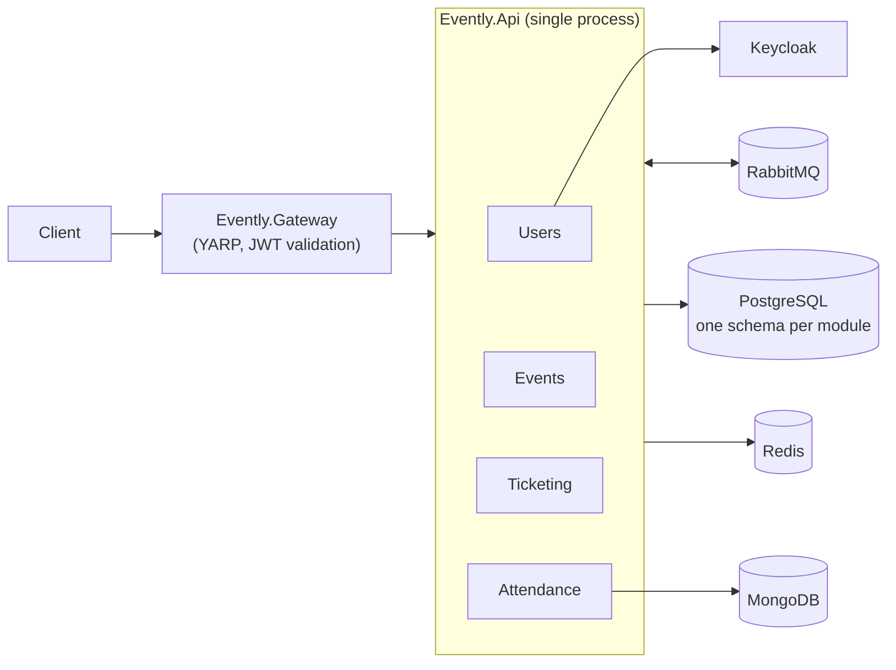

# Evently

Evently is an event management and ticketing platform built as a **modular monolith** on .NET 10. Organisers create and publish events, customers buy tickets, and attendees check in at the door.

The codebase is split into four independent modules that share one deployable API but talk to each other only through asynchronous integration events.

## Contents

- [Architecture](#architecture)
- [Modules](#modules)
- [Tech stack](#tech-stack)
- [Getting started](#getting-started)
- [Using the API](#using-the-api)
- [Configuration](#configuration)
- [Tests](#tests)
- [Project structure](#project-structure)

## Architecture



Each module follows Clean Architecture and is made of five projects:

| Project             | Responsibility                                                              |
| ------------------- | --------------------------------------------------------------------------- |
| `Domain`            | Entities, domain events, repository interfaces, `Result`-based errors       |
| `Application`       | CQRS commands and queries (MediatR), validators, domain event handlers      |
| `Infrastructure`    | EF Core `DbContext`, repositories, outbox and inbox jobs, module wiring     |
| `Presentation`      | Minimal API endpoints and integration event handlers                        |
| `IntegrationEvents` | The module's public contract, the only project other modules may reference  |

Key patterns:

- **CQRS**: commands go through EF Core, queries read with Dapper. MediatR pipeline behaviours add validation (FluentValidation), request logging and exception handling.
- **Transactional outbox**: an EF Core interceptor stores domain events in the module's `outbox_messages` table in the same transaction as the state change. A Quartz job publishes them afterwards.
- **Inbox**: integration events consumed from RabbitMQ are stored in `inbox_messages` and processed by a second Quartz job. Handlers are wrapped in idempotent decorators, so a redelivered message is not handled twice.
- **Saga**: cancelling an event is coordinated by `CancelEventSaga`, a MassTransit state machine persisted in Redis. It waits for Ticketing to refund payments and archive tickets before it publishes the completion event.
- **Module isolation**: each module owns a PostgreSQL schema (`events`, `users`, `ticketing`, `attendance`). Architecture tests fail the build if one module references another module's internals.

## Modules

| Module         | Owns                                                                                           | Notes                                                                                   |
| -------------- | ---------------------------------------------------------------------------------------------- | --------------------------------------------------------------------------------------- |
| **Events**     | Categories, events, ticket types                                                               | Event lifecycle: create, publish, reschedule, cancel. Hosts the cancellation saga.      |
| **Users**      | Users, roles, permissions                                                                      | Registers users in Keycloak and resolves each caller's permissions from the database.   |
| **Ticketing**  | Customers, carts, orders, payments, tickets                                                    | Carts live in Redis for 20 minutes. The payment service is an in-memory stub.           |
| **Attendance** | Attendees, tickets, check-ins, event statistics                                                | Check-in statistics are a projection stored in MongoDB.                                 |

Integration events between modules:

| Published by | Event                                                              | Consumed by            |
| ------------ | ------------------------------------------------------------------ | ---------------------- |
| Users        | `UserRegistered`, `UserProfileUpdated`                             | Ticketing, Attendance  |
| Events       | `EventPublished`, `EventCancellationStarted`                       | Ticketing, Attendance  |
| Events       | `TicketTypePriceChanged`                                           | Ticketing              |
| Events       | `EventCanceled`                                                    | Cancellation saga      |
| Ticketing    | `TicketIssued`                                                     | Attendance             |
| Ticketing    | `EventPaymentsRefunded`, `EventTicketsArchived`                    | Cancellation saga      |

## Tech stack

| Area            | Technology                                                        |
| --------------- | ----------------------------------------------------------------- |
| Runtime         | .NET 10, ASP.NET Core Minimal APIs, API versioning                |
| Data            | PostgreSQL (EF Core and Dapper), MongoDB, Redis                   |
| Messaging       | MassTransit on RabbitMQ, Quartz.NET for outbox and inbox jobs     |
| Identity        | Keycloak (JWT bearer), permission-based authorization             |
| Gateway         | YARP reverse proxy                                                |
| Observability   | Serilog and Seq for logs, OpenTelemetry and Jaeger for traces     |
| API docs        | OpenAPI with Scalar                                               |
| Testing         | xUnit, FluentAssertions, NSubstitute, Bogus, NetArchTest, Testcontainers |
| Code quality    | SonarAnalyzer, warnings as errors, central package management     |

## Getting started

### Prerequisites

- [.NET 10 SDK](https://dotnet.microsoft.com/download)
- [Docker](https://www.docker.com/) with Docker Compose

### Run with Docker Compose

`compose.yaml` starts the API, the gateway and every dependency.

```bash
docker compose up --build
```

On startup Keycloak imports the `evently` realm from `.files/evently-realm-export.json`, and the API applies the EF Core migrations for all four modules. Both containers run in the `Development` environment, which is where the connection strings in `appsettings.Development.json` come from.

### Services

| Service             | URL                                | Credentials                          |
| ------------------- | ---------------------------------- | ------------------------------------ |
| API                 | http://localhost:5000              |                                      |
| API reference       | http://localhost:5000/scalar       |                                      |
| Health check        | http://localhost:5000/health       |                                      |
| Gateway             | http://localhost:3000              |                                      |
| Keycloak            | http://localhost:18080             | `admin` / `admin`                    |
| Seq                 | http://localhost:8081              | `admin` / `YourSecurePassword123!`   |
| Jaeger              | http://localhost:16686             |                                      |
| RabbitMQ management | http://localhost:15672             | `guest` / `guest`                    |
| PostgreSQL          | `localhost:5433`, database `evently` | `postgres` / `postgres`            |
| MongoDB             | `localhost:27017`                  | `admin` / `admin`                    |
| Redis               | `localhost:6379`                   |                                      |

Container data is kept in `.containers/`, which is ignored by git. Delete that folder to reset the environment.

## Using the API

All routes are versioned under `/api/v1`. The interactive reference at `/scalar` is available in Development.

### Register and sign in

The examples call the API directly on port 5000. The same routes are available through the gateway on port 3000.

Register a user. This is the only anonymous endpoint:

```bash
curl -X POST http://localhost:5000/api/v1/users/register \
  -H "Content-Type: application/json" \
  -d '{"email":"jane@example.com","password":"Passw0rd!","firstName":"Jane","lastName":"Doe"}'
```

Get an access token from Keycloak with the public client:

```bash
curl -X POST http://localhost:18080/realms/evently/protocol/openid-connect/token \
  -d grant_type=password \
  -d client_id=evently-public-client \
  -d scope=openid \
  -d username=jane@example.com \
  -d password=Passw0rd!
```

Send the token as `Authorization: Bearer <access_token>` on every other request.

### Roles

New users get the `Member` role, which can search events and use carts, orders, tickets and check-in. Managing categories, events and ticket types, and reading event statistics, requires `Administrator`. There is no endpoint for granting it, so add it in the database:

```sql
INSERT INTO users.user_roles (user_id, role_name)
SELECT id, 'Administrator' FROM users.users WHERE email = 'jane@example.com';
```

### Endpoints

**Users**

| Method | Route                  | Description                 |
| ------ | ---------------------- | --------------------------- |
| POST   | `/users/register`      | Register a user             |
| GET    | `/users/profile`       | Get the current user        |
| PUT    | `/users/{id}/profile`  | Update a user's profile     |

**Events**

| Method | Route                        | Description                          |
| ------ | ---------------------------- | ------------------------------------ |
| GET    | `/categories`                | List categories                      |
| GET    | `/categories/{id}`           | Get a category                       |
| POST   | `/categories`                | Create a category                    |
| PUT    | `/categories/{id}`           | Rename a category                    |
| PUT    | `/categories/{id}/archive`   | Archive a category                   |
| GET    | `/events`                    | List events                          |
| GET    | `/events/{id}`               | Get an event                         |
| GET    | `/events/search`             | Search by category and date, paged   |
| POST   | `/events`                    | Create a draft event                 |
| PUT    | `/events/{id}/publish`       | Publish an event                     |
| PUT    | `/events/{id}/reschedule`    | Reschedule an event                  |
| DELETE | `/events/{id}/cancel`        | Cancel an event                      |
| GET    | `/ticket-types?eventId=`     | List an event's ticket types         |
| GET    | `/ticket-types/{id}`         | Get a ticket type                    |
| POST   | `/ticket-types`              | Create a ticket type                 |
| PUT    | `/ticket-types/{id}/price`   | Change a ticket type's price         |

**Ticketing**

| Method | Route                        | Description                          |
| ------ | ---------------------------- | ------------------------------------ |
| GET    | `/carts`                     | Get the current customer's cart      |
| PUT    | `/carts/add`                 | Add a ticket type to the cart        |
| PUT    | `/carts/remove`              | Remove a ticket type from the cart   |
| DELETE | `/carts`                     | Clear the cart                       |
| POST   | `/orders`                    | Create an order from the cart        |
| GET    | `/orders`                    | List the current customer's orders   |
| GET    | `/orders/{id}`               | Get an order                         |
| GET    | `/tickets/{id}`              | Get a ticket                         |
| GET    | `/tickets/code/{code}`       | Get a ticket by its code             |
| GET    | `/tickets/order/{orderId}`   | List the tickets of an order         |

**Attendance**

| Method | Route                        | Description                          |
| ------ | ---------------------------- | ------------------------------------ |
| PUT    | `/attendees/check-in`        | Check in with a ticket               |
| GET    | `/event-statistics/{id}`     | Get check-in statistics for an event |

## Configuration

| File                                             | Contents                                                              |
| ------------------------------------------------ | --------------------------------------------------------------------- |
| `src/API/Evently.Api/appsettings*.json`          | Connection strings, JWT validation, Serilog, OTLP endpoint            |
| `src/API/Evently.Api/modules.<module>*.json`     | Per-module outbox and inbox interval and batch size, Keycloak clients |
| `src/API/Evently.Gateway/appsettings*.json`      | JWT validation and YARP routes                                        |

The base files hold empty placeholders and the `Development` files hold the values for the Docker Compose environment. Override any value with environment variables, for example `ConnectionStrings__Database`.

## Tests

```bash
dotnet test
```

| Type         | Location                                                    | Needs Docker |
| ------------ | ----------------------------------------------------------- | ------------ |
| Unit         | `src/Modules/<Module>/test/*.UnitTests`                     | No           |
| Architecture | `src/Modules/<Module>/test/*.ArchitectureTests`, `test/Evently.ArchitectureTests` | No |
| Integration  | `src/Modules/<Module>/test/*.IntegrationTests`, `test/Evently.IntegrationTests`   | Yes |

Integration tests start PostgreSQL, Redis and Keycloak with Testcontainers. `test/Evently.IntegrationTests` covers flows that cross module boundaries.

To run only the tests that do not need Docker:

```bash
dotnet test --filter "FullyQualifiedName!~IntegrationTests"
```

## Project structure

```
.
├── compose.yaml                  # API, gateway and infrastructure containers
├── Directory.Build.props         # Target framework, analyzers, warnings as errors
├── Directory.Packages.props      # Central NuGet package versions
├── .files/                       # Keycloak realm import
├── src
│   ├── API
│   │   ├── Evently.Api           # Host that composes all modules
│   │   └── Evently.Gateway       # YARP reverse proxy
│   ├── Common                    # Shared kernel: Domain, Application, Infrastructure, Presentation
│   └── Modules
│       ├── Attendance
│       ├── Events
│       ├── Ticketing
│       └── Users
└── test                          # Cross-module architecture and integration tests
```
